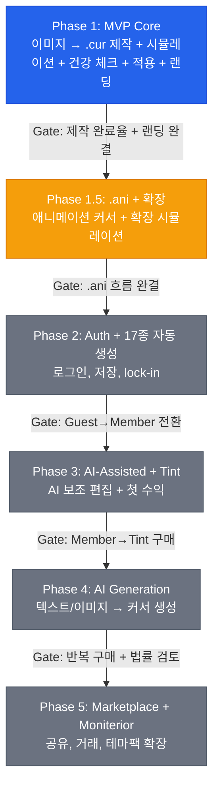

# Phase Flow

Pointint의 상위 Phase 흐름과 현재 위치를 관리하는 조감도 문서.
세부 Task/Wave/Gate 상태는 [[plans/2026-03-27-implementation-phase-flow|Implementation Phase Flow]]가 기준본이다.

---

## Current Snapshot

> **현재 상태:** Phase 1 MVP Core 게이트는 닫혔고, `P1-SHOWCASE-01` 중심의 후속 작업을 정리하는 중이다.

| Phase | 상태 | 요약 |
|---|---|---|
| Phase 1: MVP Core | ✅ gate closed / follow-up | `.cur` 제작 흐름, 시뮬레이션, 건강 체크, `.inf`, 랜딩 완료 |
| Phase 1.5: .ani + 확장 | 🟡 next candidate | 애니메이션 커서와 확장 시뮬레이션의 전략적 우선순위 |
| Phase 2: Auth + 17종 자동 생성 | ⏳ queued | 저장, 로그인, 17종 자동 변형 |
| Phase 3: AI-Assisted + Tint 도입 | ⏳ queued | AI 보조 편집 + 첫 수익 |
| Phase 4: AI Generation | ⏳ queued | 생성형 커서 제작 |
| Phase 5: Marketplace + Moniterior | ⏳ queued | 공유/거래/테마팩 생태계 |

---

## Overview

---

## Phase 1 Gate Summary

| # | Gate | 상태 | 근거 |
|---|---|---|---|
| 1 | `.cur` 제작 흐름 완결 | ✅ | 업로드→편집→Hotspot→다운로드 |
| 2 | 시뮬레이션 동작 | ✅ | 미리보기 + 인터랙티브 동작 |
| 3 | 건강 체크 동작 | ✅ | 다운로드 전 진단 표시 |
| 4 | `.inf` 적용 동작 | ✅ | 설치/원복 흐름 포함 |
| 5 | 배포 안정성 | ✅ | Vercel + Railway + HF Space |
| 6 | 랜딩 페이지 완결 | ✅ | 랜딩 + FAQ + SEO/GEO + OG 동작 |

---

## Next Decision

- 현재 기준 다음 실행 후보는 `P1-SHOWCASE-01`이다.
- showcase/hotspot follow-up을 짧게 마무리한 뒤 `Phase 1.5` 스프린트를 선언하는 흐름이 가장 자연스럽다.
- Phase 전환 판단은 항상 [[ACTIVE_SPRINT]]와 [[plans/2026-03-27-implementation-phase-flow]]를 함께 본다.

---

## Related

- [[ACTIVE_SPRINT]]
- [[Implementation-Plan]]
- [[plans/2026-03-27-implementation-phase-flow]]
- [[plans/Plans-Index]]
