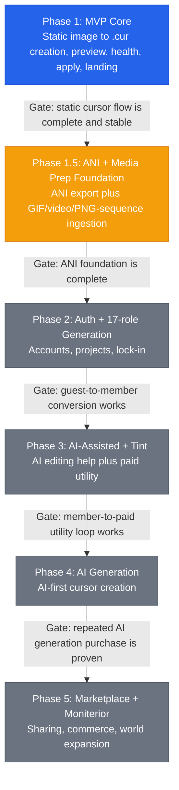

# Phase Flow

Pointint's high-level phase summary lives here.
Detailed task, wave, and gate status stays in [[plans/2026-03-27-implementation-phase-flow|Implementation Phase Flow]].

> **Roadmap Reference:** [[plans/2026-04-12-cursor-suite-roadmap-design]]
> This roadmap is a reference document. It does not replace sprint or phase execution docs.

---

## Current Snapshot

> **Current State:** Phase 1 MVP Core is gate-closed and still running a final follow-up slice around trust/polish before the Phase 1.5 decision.

| Phase | Status | Summary |
|---|---|---|
| Phase 1: MVP Core | gate closed / follow-up | `.cur` creation, preview, health check, install flow, browse/make IA split, and consent-gated analytics are shipped |
| Phase 1.5: ANI + Media Prep Foundation | next candidate | ANI export plus GIF/video/PNG-sequence ingestion foundation |
| Phase 2: Auth + 17-role generation | queued | account system, projects, and 17-role conversion |
| Phase 3: AI-Assisted + Tint | queued | AI editing assist plus paid utility loop |
| Phase 4: AI Generation | queued | AI-first cursor generation |
| Phase 5: Marketplace + Moniterior | queued | sharing, marketplace, and world expansion |

---

## Overview

---

## Phase 1 Gate Summary

| # | Gate | Status | Evidence |
|---|---|---|---|
| 1 | `.cur` creation flow complete | complete | upload -> edit -> hotspot -> download is working |
| 2 | preview is working | complete | preview and simulation are working |
| 3 | health check is working | complete | visibility/hotspot/readability feedback exists |
| 4 | install flow is working | complete | install/restore assets are packaged |
| 5 | deployment is stable | complete | Vercel + Railway + HF Space are active |
| 6 | landing is complete | complete | landing, FAQ, SEO/GEO, and OG metadata are active |

---

## Next Decision

- `P1-SHOWCASE-01` is closed.
- `P1-HOTSPOT-01` and `P1-ANALYTICS-01` are closed.
- The current follow-up order is `P1-MOCKUP-01` -> `Phase 1.5 planning`.
- ANI is still a `Phase 1.5` candidate only. Current workflow cards expose ANI as `Soon`, but no animated ingestion or `.ani` export is implemented yet.
- `Phase 1.5` is now defined more precisely as `ANI + Media Prep Foundation`.
- The long-term roadmap stays in [[plans/2026-04-12-cursor-suite-roadmap-design]] and should only be promoted into official phase scope case by case.

---

## Related

- [[ACTIVE_SPRINT]]
- [[Implementation-Plan]]
- [[plans/2026-03-27-implementation-phase-flow]]
- [[plans/2026-04-12-cursor-suite-roadmap-design]]
- [[plans/Plans-Index]]
