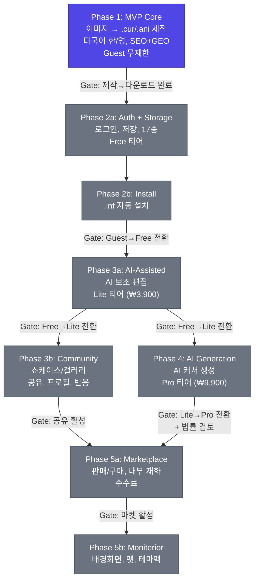
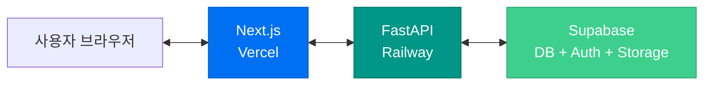
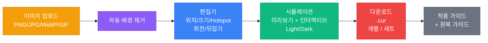
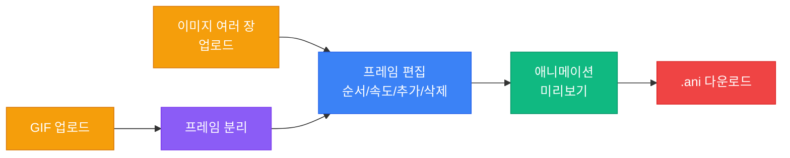
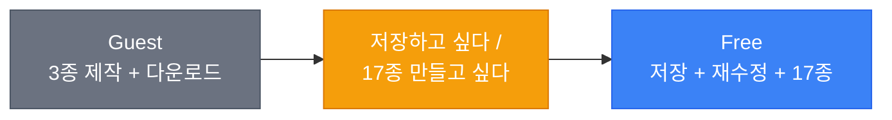
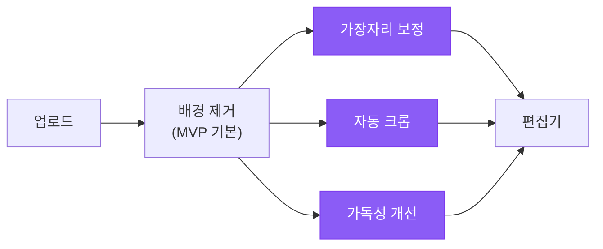
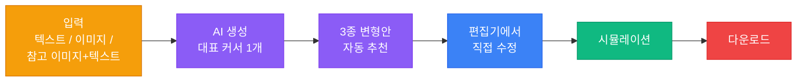
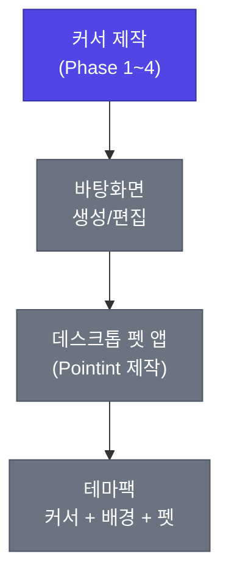

# Phase Flow

Phase별 구현 범위, 게이트 기준, 진행 현황을 관리하는 조감도 문서.
태스크 상세는 [[plans/2026-03-27-implementation-phase-flow|Implementation Phase Flow]] 참조.

---

## Overview

> **3b와 4는 병렬:** Phase 3a 완료 후 커뮤니티(3b)와 AI 생성(4)을 독립적으로 진행할 수 있다.

---

## 스택

---

## Phase 1 — MVP Core 🔄 (현재)

> **핵심 질문:** 사람들은 이미지를 커서로 만들고, 다운로드해서 적용할 만큼 이 흐름을 가치 있게 느끼는가?

### 제작 흐름 (.cur)

### 제작 흐름 (.ani)

### 범위

- .cur 정적 커서 제작
- .ani 애니메이션 커서 제작 (심플하게, 이후 고도화)
- 자동 배경 제거 (MVP부터 최선 품질)
- 편집기 (위치, 크기, Hotspot, 회전/뒤집기)
- 시뮬레이션 (미리보기 + 인터랙티브, Light/Dark)
- 다운로드 (개별 + 세트 zip)
- 적용 가이드 + 원복 가이드
- **다국어 한/영**
- **SEO + GEO 기본** (메타 태그, JSON-LD, FAQ, sitemap)
- **랜딩 + 가이드 모바일 반응형** (편집기는 데스크톱 전용)
- **소셜 공유 메타** (정적 OG image)
- Rate limiting + 봇 방어

### 모바일 대응

- 랜딩: 반응형
- 편집기: 데스크톱 전용 ("데스크톱에서 만들어보세요" 안내)
- 적용 가이드: 반응형

### Gate → Phase 2a

| # | 게이트 | 상태 |
|---|---|---|
| 1 | .cur 제작 흐름 완결 | ⏳ |
| 2 | .ani 제작 흐름 완결 | ⏳ |
| 3 | 시뮬레이션 동작 (미리보기 + 인터랙티브) | ⏳ |
| 4 | 적용 가이드 표시 | ⏳ |
| 5 | 한/영 다국어 동작 | ⏳ |
| 6 | 봇 방어 동작 | ⏳ |
| 7 | Vercel + Railway 배포 안정 | ⏳ |

---

## Phase 2a — Auth + Storage ⏳

> **핵심 질문:** 저장과 17종 전체가 가입 동기로 충분한가?

### 사용자 전환 흐름

### 범위

- Supabase Auth (이메일 + 소셜)
- 프로젝트 저장 / 목록 / 재수정
- 17종 전체 커서 제작 (Free)
- 기본 약관 + 면책 조항

### Gate → Phase 2b

| # | 게이트 | 상태 |
|---|---|---|
| 1 | 로그인 + 프로젝트 저장 동작 | ⏳ |
| 2 | 17종 제작 + 다운로드 동작 | ⏳ |
| 3 | Guest→Free 전환 발생 | ⏳ |
| 4 | 약관 준비 완료 | ⏳ |

---

## Phase 2b — Install ⏳

> **핵심 질문:** .inf 원클릭 설치가 사용자 만족도를 높이는가?

### 범위

- .inf 자동 설치 스크립트 생성
- 17종 세트 원클릭 적용
- 레지스트리 경로: `HKEY_CURRENT_USER\Control Panel\Cursors`
- 설치/원복 안내 업데이트

### Gate → Phase 3a

| # | 게이트 | 상태 |
|---|---|---|
| 1 | .inf 설치 + 원복 동작 | ⏳ |
| 2 | 가이드 업데이트 완료 | ⏳ |

---

## Phase 3a — AI-Assisted ⏳

> **핵심 질문:** AI 보조가 유료 전환을 만드는가?

### AI 보조 흐름

### 범위

- AI 보조 편집 (가장자리, 크롭, 가독성, 실루엣)
- Lite 티어 결제 (₩3,900/월)
- AI credit 내부 구조

### Gate → Phase 3b / Phase 4 (병렬)

| # | 게이트 | 상태 |
|---|---|---|
| 1 | AI 보조 기능 동작 | ⏳ |
| 2 | Lite 결제 흐름 동작 | ⏳ |
| 3 | Free→Lite 전환 발생 | ⏳ |

---

## Phase 3b — Community ⏳ (4와 병렬)

> **핵심 질문:** 사용자들이 만든 커서를 공유하고 싶어하는가?

### 범위

- 쇼케이스 갤러리 (다른 사람 커서 구경)
- 공유 기능 (내 커서를 갤러리에 올리기)
- 유저 프로필 (만든 커서 모음)
- 좋아요 / 반응
- 신고 체계 기본
- **동적 OG 이미지** (커서별 SNS 미리보기)
- **쇼케이스 모바일 반응형**

### Gate → Phase 5a

| # | 게이트 | 상태 |
|---|---|---|
| 1 | 갤러리 + 공유 동작 | ⏳ |
| 2 | 공유 → 외부 유입 발생 | ⏳ |
| 3 | 동적 OG 이미지 동작 | ⏳ |

---

## Phase 4 — AI Generation ⏳ (3b와 병렬)

> **핵심 질문:** AI 생성이 더 깊은 창작을 만드는가?

### AI 생성 흐름

### 범위

- 텍스트/이미지 기반 커서 생성
- 3종 변형안 자동 추천
- Pro 티어 결제 (₩9,900/월)
- Credit 체계 (보정 1cr, 생성 2cr)
- ⚠️ BLOCKING: AI 생성물 소유권 법률 검토

### Gate → Phase 5a

| # | 게이트 | 상태 |
|---|---|---|
| 1 | AI 생성 동작 | ⏳ |
| 2 | Generate→Edit→Simulate→Download 흐름 | ⏳ |
| 3 | Pro 결제 흐름 동작 | ⏳ |
| 4 | 법률 검토 완료 | ⏳ |

---

## Phase 5a — Marketplace ⏳

> **핵심 질문:** 제작과 소비가 하나의 루프로 도는가?

### 유저 루프

### 범위

- 판매 등록 / 구매 / 수집
- 내부 재화 지갑
- 수수료 (Lite 20%, Pro 10%)
- 마켓플레이스 모바일 반응형
- ⚠️ BLOCKING: DMCA + 마켓플레이스 약관 + NSFW 스캔 + 권리 확인 절차

### Gate → Phase 5b

| # | 게이트 | 상태 |
|---|---|---|
| 1 | 판매/구매 흐름 동작 | ⏳ |
| 2 | 내부 재화 순환 동작 | ⏳ |
| 3 | 법률/콘텐츠 정책 준비 완료 | ⏳ |

---

## Phase 5b — Moniterior ⏳

> **핵심 질문:** 모니테리어가 하나의 세계관으로 묶이는가?

### 모니테리어 확장

### 범위

- 공식 테마팩
- 바탕화면 이미지 생성/편집
- 데스크톱 펫 앱
- 테마팩 패키징 (커서 + 배경 + 펫)

---

## 티어 진화

---

## Phase별 법률 체크포인트

| Phase | 법률 체크 | 시급도 |
|---|---|---|
| Phase 2a | 기본 약관 + 면책 조항 | 필수 |
| Phase 3b | 공유 콘텐츠 정책 | 필수 |
| Phase 4 | AI 생성물 소유권 법률 검토 | BLOCKING |
| Phase 5a | DMCA, 마켓플레이스 약관, NSFW, 콘텐츠 정책 | BLOCKING |

---

## Phase별 모바일 대응

| Phase | 반응형 화면 |
|---|---|
| Phase 1 | 랜딩, 적용 가이드 |
| Phase 3b | 쇼케이스, 유저 프로필 |
| Phase 5a | 마켓플레이스 (구경/구매) |

편집기, 시뮬레이션은 모든 Phase에서 데스크톱 전용.

---

## Phase 간 전환 원칙

- 각 Phase는 이전 Phase의 **Gate가 충족된 뒤** 착수한다
- **예외: 3b와 4는 병렬** — 3a 완료 후 독립적으로 진행 가능
- "검증"은 사용자 행동 데이터와 운영 안정성으로 판단한다
- 다음 Phase를 미리 설계하되, 현재 Phase의 품질을 희생하지 않는다
- BLOCKING 태스크는 Gate 통과 전 반드시 해결한다

---

## 관련 문서

### 구현

- [[ACTIVE_SPRINT]] — 현재 진행 중인 태스크
- [[plans/2026-03-27-implementation-phase-flow]] — 태스크 상세 (Task ID, Wave별)
- [[plans/Plans-Index]] — 계획 문서 허브

### 제품

- [[01-Core/Roadmap]] — 제품 로드맵
- [[01-Core/Tech-Stack]] — 기술 스택
- [[08-Business/Tier-Pricing]] — 티어/가격

### 정책

- [[05-Operations/legal/Content-Policy]] — 법률/콘텐츠 정책

### 유입/성장

- SEO + GEO 체크리스트 → `docs/SEO-GEO 체크리스트.md`
- 모바일 대응 정책 → `docs/모바일 대응 정책.md`
- 소셜 공유 메타 → `docs/소셜 공유 메타.md`
