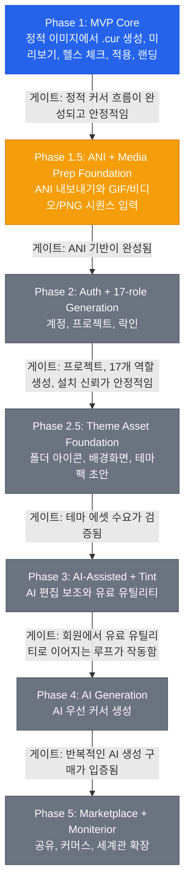

# 단계 흐름

Pointint의 상위 단계 요약은 이 문서에서 관리한다.
현재 실행 상태는 [[ACTIVE_SPRINT]]에 둔다. 과거 작업, 웨이브, 게이트 세부 내용은 [[plans/2026-03-27-implementation-phase-flow|Implementation Phase Flow]]에 남아 있을 수 있지만, 해당 문서는 레거시 스냅샷이며 현재 기준 문서는 아니다.

> **로드맵 참고:** [[plans/2026-04-12-cursor-suite-roadmap-design]]
> 이 로드맵은 참고 문서다. 스프린트나 단계 실행 문서를 대체하지 않는다.

---

## 현재 스냅샷

> **현재 상태:** Phase 1 MVP Core는 게이트 종료 상태다. Phase 1.5는 GIF 우선 ANI v1 슬라이스로 열렸고 현재 진행 중이다. Phase 2.5는 Auth/17-role/install 작업 이후 진행할 테마 에셋 기반 단계로 대기열에 추가되었다.

| 단계 | 상태 | 요약 |
|---|---|---|
| Phase 1: MVP Core | 게이트 종료 | `.cur` 생성, 미리보기, 헬스 체크, 설치 흐름, 둘러보기/만들기 IA 분리, 동의 기반 분석이 출시됨 |
| Phase 1.5: ANI + Media Prep Foundation | 진행 중 | GIF 우선 ANI v1과 이후 비디오/PNG 시퀀스 입력을 위한 미디어 준비 기반 |
| Phase 2: Auth + 17-role generation | 대기 | 계정 시스템, 프로젝트, 17개 Windows 역할 변환 |
| Phase 2.5: Theme Asset Foundation | 대기 | 프로젝트 저장과 커서 세트 신뢰가 안정화된 뒤 폴더 아이콘, 배경화면 내보내기, 첫 테마팩 초안 |
| Phase 3: AI-Assisted + Tint | 대기 | AI 편집 보조와 유료 유틸리티 루프 |
| Phase 4: AI Generation | 대기 | AI 우선 커서 생성 |
| Phase 5: Marketplace + Moniterior | 대기 | 공유, 마켓플레이스, 세계관 확장 |

---

## 개요

```mermaid
graph TD
    P1["Phase 1: MVP Core<br/>정적 이미지에서 .cur 생성, 미리보기, 헬스 체크, 적용, 랜딩"]
    P15["Phase 1.5: ANI + Media Prep Foundation<br/>ANI 내보내기와 GIF/비디오/PNG 시퀀스 입력"]
    P2["Phase 2: Auth + 17-role Generation<br/>계정, 프로젝트, 락인"]
    P25["Phase 2.5: Theme Asset Foundation<br/>폴더 아이콘, 배경화면, 테마팩 초안"]
    P3["Phase 3: AI-Assisted + Tint<br/>AI 편집 보조와 유료 유틸리티"]
    P4["Phase 4: AI Generation<br/>AI 우선 커서 생성"]
    P5["Phase 5: Marketplace + Moniterior<br/>공유, 커머스, 세계관 확장"]

    P1 -->|"게이트: 정적 커서 흐름이 완성되고 안정적임"| P15
    P15 -->|"게이트: ANI 기반이 완성됨"| P2
    P2 -->|"게이트: 프로젝트, 17개 역할 생성, 설치 신뢰가 안정적임"| P25
    P25 -->|"게이트: 테마 에셋 수요가 검증됨"| P3
    P3 -->|"게이트: 회원에서 유료 유틸리티로 이어지는 루프가 작동함"| P4
    P4 -->|"게이트: 반복적인 AI 생성 구매가 입증됨"| P5

    style P1 fill:#2563eb,stroke:#1d4ed8,color:#fff
    style P15 fill:#f59e0b,stroke:#d97706,color:#fff
    style P2 fill:#6b7280,stroke:#4b5563,color:#fff
    style P25 fill:#6b7280,stroke:#4b5563,color:#fff
    style P3 fill:#6b7280,stroke:#4b5563,color:#fff
    style P4 fill:#6b7280,stroke:#4b5563,color:#fff
    style P5 fill:#6b7280,stroke:#4b5563,color:#fff
```

---

## Phase 1 게이트 요약

| # | 게이트 | 상태 | 근거 |
|---|---|---|---|
| 1 | `.cur` 생성 흐름 완료 | 완료 | 업로드 -> 편집 -> 핫스팟 -> 다운로드가 작동함 |
| 2 | 미리보기 작동 | 완료 | 미리보기와 시뮬레이션이 작동함 |
| 3 | 헬스 체크 작동 | 완료 | 가시성/핫스팟/가독성 피드백이 존재함 |
| 4 | 설치 흐름 작동 | 완료 | 설치/복원 에셋이 패키징됨 |
| 5 | 배포 안정화 | 완료 | Vercel + Railway + HF Space가 활성 상태임 |
| 6 | 랜딩 완료 | 완료 | 랜딩, FAQ, SEO/GEO, OG 메타데이터가 활성 상태임 |

---

## 다음 결정

- `P1-SHOWCASE-01`은 종료됨.
- `P1-HOTSPOT-01`과 `P1-ANALYTICS-01`은 종료됨.
- `P1-MOCKUP-01`은 연기되었고 더 이상 단계 전환을 막지 않음.
- `ANI > Animated GIF`가 첫 실제 ANI 진입점이 됨. 나머지 ANI 카드는 `Soon` 상태로 유지함.
- 현재 Phase 1.5 슬라이스는 `GIF -> 공통 프레이밍/핫스팟 -> .ani 내보내기`임.
- `Phase 1.5`는 이제 `ANI + Media Prep Foundation`으로 더 정확하게 정의됨.
- `Phase 2.5: Theme Asset Foundation`은 현재 Phase 1.5 작업으로 끌어올리지 않고 Phase 2 이후 대기열에 둠.
- Phase 2.5는 `Folder Icon Maker`, 배경화면 내보내기, 커서/아이콘/배경화면 테마팩 초안으로 시작해야 함. 사운드 구성, 라이브 배경화면, 데스크톱 펫, 마켓플레이스 판매, 자동 테마 설치기는 이후 단계로 둠.
- 장기 로드맵은 [[plans/2026-04-12-cursor-suite-roadmap-design]]에 유지하고, 공식 단계 범위로 승격할 때는 건별로 판단해야 함.

---

## 관련 문서

- [[ACTIVE_SPRINT]]
- [[Implementation-Plan]]
- [[plans/2026-03-27-implementation-phase-flow]]
- [[plans/2026-04-12-cursor-suite-roadmap-design]]
- [[plans/Plans-Index]]
